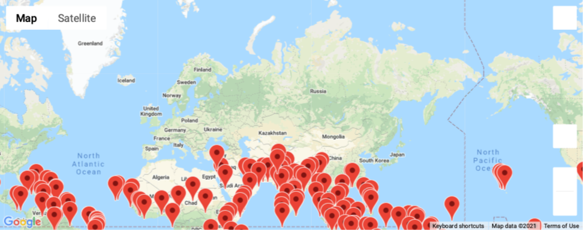
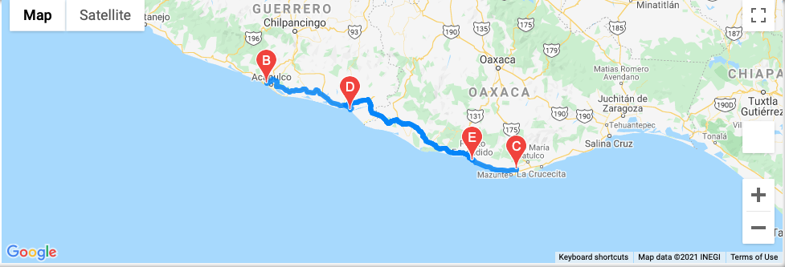
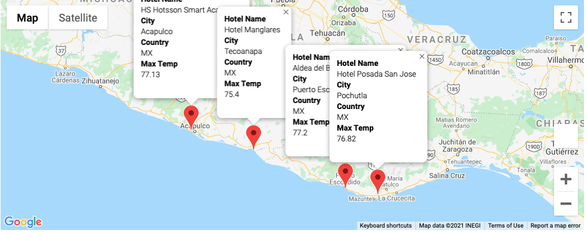

# World_Weather_Analysis

## Project Overview

Project OverviewIn this project, we use the NumPy module to generate more than 2000 random latitudes and longitudes, and citipy to locate the nearest cities.

Using APIs from Google and OpenWeatherMap we can extract data to create information such: 
 Latitude versus temperature 
 Latitude versus humidity 
 Latitude versus cloudiness
 Latitude versus wind speed 
 Latitude and temperature 
 Latitude and humidity

The travel app permits us to know in real-time the temperature of the globe. 

Also, we can give the hotel information from the preferred cities.

